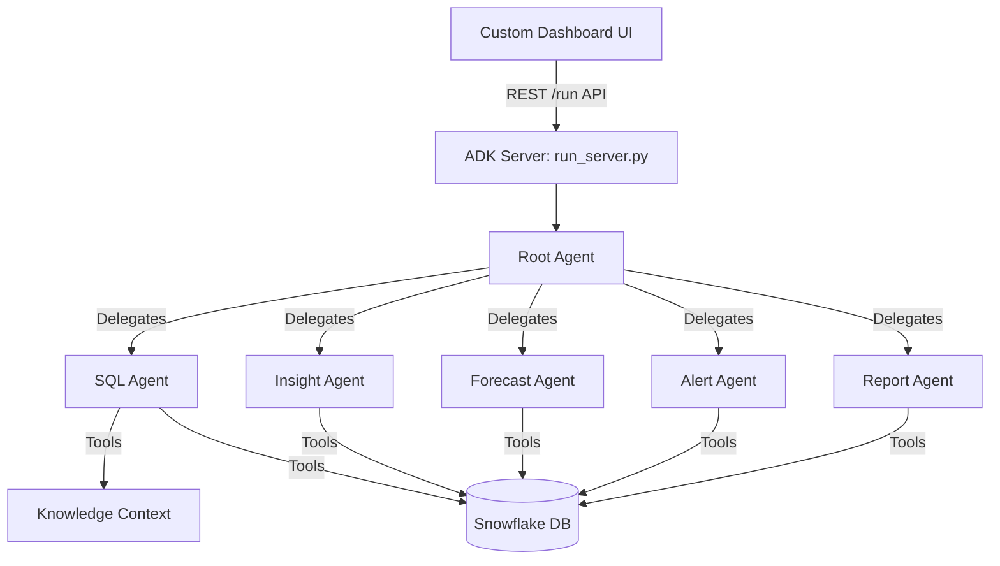

# ExecutiveAI

**ExecutiveAI** is a CEO-facing, multi-agent business intelligence platform. It allows non-technical users to ask plain-English questions about their business data and instantly receive accurate, real-time answers backed by live Snowflake data. 

The system leverages the **Google Agent Development Kit (ADK)** and the **Gemini 2.0 Flash** model to orchestrate a team of specialized AI agents.

---

## 🏗️ System Architecture

The project is built on a modern, lightweight, and scalable architecture:

1. **Backend**: Python (ADK/FastAPI) running a stateless server.
2. **AI Models**: Google Gemini 2.0 Flash for reasoning, SQL generation, and analysis.
3. **Database**: Snowflake (Read-only RSA Keypair Authentication).
4. **Frontend**: Pure HTML/CSS/JS dashboard served directly from the backend (no React/Node overhead).



---

## 🤖 The Multi-Agent Team

ExecutiveAI uses a hierarchical multi-agent pattern. The **Coordinator (`root_agent`)** receives user queries from the dashboard and delegates them to one of five **Specialist Agents** based on a routing prefix (e.g., `[INSIGHT_AGENT]`). 

| Agent Name | Role | Location |
|---|---|---|
| **`root_agent`** | **Coordinator:** Routes questions to the correct specialist based on UI tab selection. | `executive_ai/agent.py` |
| **`sql_agent`** | **Data Retrieval:** Generates safe SQL and pulls raw data from Snowflake. | `sql_agent/agent.py` |
| **`insight_agent`** | **Analysis:** Explains *why* numbers changed and identifies trends. | `insight_agent/agent.py` |
| **`forecast_agent`** | **Projections:** Predicts future metrics based on historical data. | `forecast_agent/agent.py` |
| **`alert_agent`** | **Anomalies:** Scans for sudden drops, spikes, or threshold breaches. | `alert_agent/agent.py` |
| **`report_agent`** | **Briefings:** Compiles multi-KPI structured executive summaries. | `report_agent/agent.py` |

---

## 🛠️ Key Tools & Security

The agents rely on two primary python-based tools to interact with the database safely:

1. **`get_context_tool`**: Assembles static JSON files from the `knowledge/` directory into a prompt. This gives the model the exact Snowflake schema, allowable metrics, and KPI definitions without needing to execute `SHOW TABLES` queries on the database.
2. **`run_sql_tool`**: Safely executes SQL against Snowflake. 
   - **Guardrails:** Uses `sqlglot` to parse the query, ensuring it only contains `SELECT` statements and only queries allowed tables.
   - **Auto-Limit:** Automatically appends a `LIMIT 500` to prevent massive data dumps.
   - **Serialization:** Safely converts `datetime` and `Decimal` objects into JSON-compliant formats before returning them to the model.

---

## 🖥️ UI Dashboard

The frontend is a custom-built, premium dark-mode interface designed for executives. It is completely static (`index.html`, `style.css`, `app.js`) and is served directly by the ADK backend via FastAPI's `StaticFiles`.

**Features:**
- **Agent Selector Tabs:** Direct questions to specific AI specialists.
- **Smart Table Rendering:** Automatically detects raw JSON data returned by the agents and formats it into clean HTML tables.
- **No CORS Issues:** By serving the frontend from the exact same port as the ADK API (`http://127.0.0.1:8000`), all cross-origin restrictions are eliminated.

---

## 🚀 How to Run Locally

1. **Clone the repository and install dependencies:**
   ```bash
   pip install -r requirements.txt
   ```

2. **Ensure environment variables are set** in `.env`:
   ```
   GEMINI_API_KEY=AIzaSy...
   SNOWFLAKE_ACCOUNT=...
   SNOWFLAKE_USER=...
   SNOWFLAKE_PRIVATE_KEY=...
   ```

3. **Start the single unified server:**
   ```bash
   python run_server.py
   ```

4. **Access the application:**
   - **Dashboard:** [http://127.0.0.1:8000/dashboard/](http://127.0.0.1:8000/dashboard/)
   - **ADK Dev UI:** [http://127.0.0.1:8000/dev-ui](http://127.0.0.1:8000/dev-ui)
